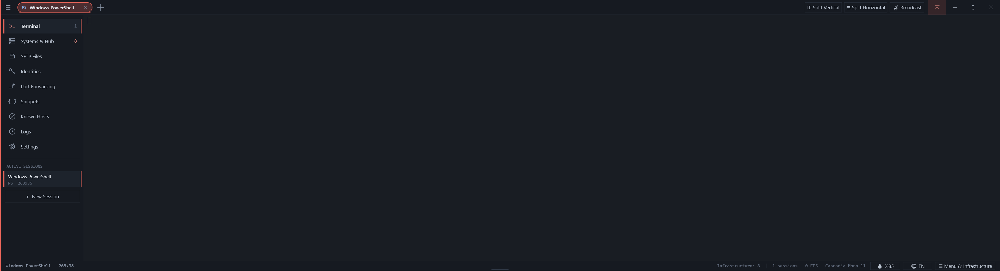

<p align="center">
  
</p>

<h1 align="center">FullTerminal</h1>

<p align="center">
  <b>Ultra-Fast GPU-Accelerated Windows Terminal, SSH/SFTP DevOps Hub & AI Agent Workspace</b><br>
  <i>Built with Pure C++20, Direct2D Hardware Acceleration, and Zero Web Bloatware.</i>
</p>

<p align="center">
  
  
  
  
  
  
</p>

<p align="center">
  
</p>

---

## ⚡ Overview

**FullTerminal** is a high-performance, single-binary native Windows terminal emulator, remote server manager (SSH / SFTP), and local AI agent workspace. 

Engineered from scratch in pure **C++20** with hardware-accelerated **Direct2D / DirectWrite** text rendering, FullTerminal delivers sub-millisecond input latency, crisp typography, and an extensive suite of DevOps workflows—without Electron, Node.js, or heavyweight web runtimes.

> [!NOTE]
> **Zero Installation Required**: Runs as a single, fully portable standalone executable (`FullTerminal.exe`, ~1.5 MB). All configurations and encrypted credentials remain in a portable folder alongside the binary.

---

## 🤖 The Vibe Coding Story & Radical Transparency

FullTerminal is proudly built through **Vibe Coding**—a pair-programming collaboration between human engineering direction and frontier AI:

* **Human Vision & Direction**: System architecture, Win32 message loop design, ergonomic UX, feature specifications, and real-time debugging led by **[@geataa](https://github.com/geataa)** / **SkySoft**.
* **AI Agentic Execution**: High-throughput C++20 implementation, Direct2D graphics pipeline design, terminal emulation state machines, and localized i18n syntheses powered by **Google DeepMind's Gemini 3.8 via Antigravity**.

### 🛠️ Work in Progress & Active Polish
FullTerminal was built rapidly and passionately. While the core engines are backed by deterministic unit tests (covering VT parsing, color synchronization, OSC semantics, session serialization, and i18n), **not every single edge case across all Windows environments has been battle-tested yet**. 

We believe in radical honesty: you might run into quirks or undiscovered bugs! We are actively dogfooding FullTerminal daily, and bugs will be identified, patched, and deployed rapidly. If you spot anything strange, please open an issue or drop us feedback!

---

## 🌟 Key Features

### 🚀 Direct2D GPU Text Rendering Engine
* **Hardware-Accelerated**: Direct3D 11 & Direct2D pipeline with DirectWrite typography, subpixel anti-aliasing, and vsync display synchronization.
* **Standards Compliant**: VT100 / VT220 / xterm-256color and truecolor (24-bit RGB) ANSI support.
* **Semantic Shell Integration (OSC 133)**: Recognizes command boundaries, execution status, and enables instant semantic navigation (`Ctrl+Shift+Up` / `Down`).
* **Interactive Hyperlinks (OSC 8)**: Autodetects URLs and supports explicit OSC 8 links (`Ctrl+Click` to open directly in your default browser).

### 🪟 Dynamic Tiling Split Panes (Herdr Architecture)
* Split any terminal tab vertically (`Ctrl+Shift+D`) or horizontally (`Ctrl+Shift+E`).
* Re-tile, zoom any pane to full-canvas (`Ctrl+Shift+Z`), and switch focus smoothly (`Ctrl+Alt+Arrows`).
* Full tab title customization and renaming modal with backdrop dismissal and complete text selection (`Ctrl+A`, caret positioning).

### 👻 Desktop Transparency & Opacity Control
* Adjustable terminal canvas transparency from **10% to 100%** with seamless desktop pass-through.
* Smart overlay isolation: SFTP screens, settings modals, and dialogs remain crisp and readable while terminal viewports remain transparent.

### 🎮 Quake / Visor Drop-Down Console
* Summon and dismiss FullTerminal from the top of the monitor using a global hotkey (default: `F12`, customizable with conflict detection).
* Smooth slide-down and pull-up animations, taskbar-independent operation, and interactive bottom resizing grip.

### 🌐 SSH Infrastructure Hub & Stage Loading
* Visual SSH host inventory with jump host (proxy jump) support, tag filtering, and identity management.
* **Stage-Aware SSH Loading Screen**: Interactive connection progress tracker that suppresses raw OpenSSH debug noise and visual artifacts for a pristine loading experience.

### 📁 Dual-Pane SFTP File Explorer
* Built-in remote file management alongside active shell sessions.
* Browse remote directories, upload, download, rename, and preview remote files with a single click.

### 📡 Broadcast Input Mode (`Ctrl+Shift+I`)
* Mirror keystrokes and shell commands simultaneously across all active panes and sessions for rapid multi-server cluster orchestration.

### 📹 Session Recording & Built-in Replayer
* Record live terminal sessions into ultra-compact binary `.ftrec` files or universal Asciinema `.cast` format.
* Replay recorded sessions offline directly inside FullTerminal.

### 🌍 16-Language Native Internationalization (i18n)
* Comprehensive multilingual translation across all menus, dialogs, buttons, and HUD notifications.
* **Supported Languages**: English, Turkish, German, French, Spanish, Italian, Portuguese, Dutch, Polish, Czech, Russian, Ukrainian, Japanese, Korean, Simplified Chinese, Arabic.
* Instant 1-click on-the-fly language cycling without restarting the application.

### ☸️ Kubernetes YAML & Command Snippets
* Integrated snippet and manifest manager.
* 1-click `kubectl apply -f -` pipe to stream YAML manifests directly into the active cluster terminal.

### 🤖 Model Context Protocol (MCP) Bridge & Agent Fleet
* Exposes terminal management tools (`ft_systems`, `ft_exec`, `ft_fs`, `ft_vault`) to autonomous AI coding assistants.
* Interactive Agent Approval Ribbon with live approval/denial controls (`Ctrl+Shift+Y` / `Ctrl+Shift+N`) and audit logging.

---

## 💡 Open Source Inspirations

FullTerminal was deeply inspired by the pioneers of modern, open-source terminal engineering. We pay homage to these incredible open-source projects:

* **[Alacritty](https://github.com/alacritty/alacritty)** *(Apache-2.0)* - Pioneering the standard of raw GPU acceleration and minimal latency.
* **[WezTerm](https://github.com/wez/wezterm)** *(MIT)* - Inspiring rich terminal multiplexing, font shaping, and robust configuration.
* **[Windows Terminal](https://github.com/microsoft/terminal)** *(MIT)* - The gold standard of ConPTY architecture and Windows platform integration.
* **[Kitty](https://github.com/kovidgoyal/kitty)** *(GPL-3.0)* - Trailblazer of modern graphics protocols, keyboard handling, and speed.
* **[Ghostty](https://github.com/ghostty-org/ghostty)** *(MIT)* - Benchmark for modern native UI design, elegance, and multi-platform excellence.

---

## ⌨️ Essential Keyboard Shortcuts

| Shortcut | Action |
| :--- | :--- |
| `Ctrl + Shift + T` | Open new tab (Default Profile) |
| `Ctrl + Shift + W` | Close active pane or active tab |
| `Ctrl + Shift + D` | Split active tab vertically |
| `Ctrl + Shift + E` | Split active tab horizontally |
| `Ctrl + Shift + Z` | Toggle pane zoom (maximize active pane) |
| `Ctrl + Alt + Arrows` | Cycle focus between split panes |
| `Ctrl + Shift + I` | Toggle Broadcast Input Mode (all panes) |
| `Ctrl + Shift + C` | Copy selection to clipboard |
| `Ctrl + Shift + V` | Paste from clipboard with safety strip |
| `Ctrl + Shift + B` | Toggle collapsible sidebar |
| `Ctrl + Shift + H` | Switch to SSH Hosts screen |
| `Ctrl + Shift + S` | Switch to Settings screen |
| `Ctrl + Shift + R` | Start / Stop terminal session recording |
| `Ctrl + Shift + Up / Down` | Jump to previous / next command prompt (OSC 133) |
| `F12` | Toggle Quake / Visor console drop-down |
| `Ctrl + Tab` | Next tab |
| `Ctrl + Shift + Tab` | Previous tab |
| `Double-Click Tab` | Rename tab |

---

## 🔨 Building from Source

### Prerequisites
* Windows 10 (version 1809+) or Windows 11 64-bit
* Visual Studio 2022 (Community, Professional, or Build Tools) with the **Desktop development with C++** workload
* Windows 10/11 SDK

### Build via Command Line
Simply run the root build script:
```bat
build.bat
```
The script will locate your MSVC environment, compile resources with `rc.exe`, build all C++20 units via `cl.exe`, and output the optimized binary directly to `bin\FullTerminal.exe`.

### Running Automated Test Suites
FullTerminal includes modular test suites in the `tests\` folder:
```bat
tests\run_i18n_test.bat             :: Validates 16 languages x 153 keys
tests\run_theme_test.bat            :: Validates color normalization & cursor states
tests\run_opacity_accent_test.bat   :: Validates transparency & accent styling
tests\run_osc_test.bat              :: Validates OSC 8 hyperlinks & OSC 133 shell semantics
tests\run_recording_test.bat        :: Validates .ftrec & .cast recording serialization
tests\run_resize_snippet_test.bat   :: Validates scrollback pullback & snippet updates
tests\run_ssh_loading_test.bat      :: Validates SSH loading screen state transitions
```

---

## 🎮 Also From SkySoft / geataa on Steam

When we're not crafting high-performance developer tools, we make video games! Check out our two published titles on Steam:

<div align="center">

### 🧗 [BouncyClimb](https://store.steampowered.com/app/4787630/)
*A high-octane, physics-defying multiplayer climbing and platforming adventure! Race against your friends, scale hazardous heights, and master the bounce.*

[](https://store.steampowered.com/app/4787630/)

---

### 🍸 [Neon Angora](https://store.steampowered.com/app/4447940/)
*A groundbreaking social simulation and nightclub roleplaying experience powered by Local LLM AI. No canned dialogue trees—speak your mind, influence dynamic NPCs, uncover secrets, and experience a living story that reacts to who you choose to be.*

[](https://store.steampowered.com/app/4447940/)

</div>

---

## 📄 License

FullTerminal is distributed under the **[MIT License](LICENSE)**. You are completely free to use, modify, distribute, and integrate it into private or commercial environments.

<p align="center">
  Crafted with passion, C++20, and Vibe Coding by <b>SkySoft / geataa</b>.
</p>
